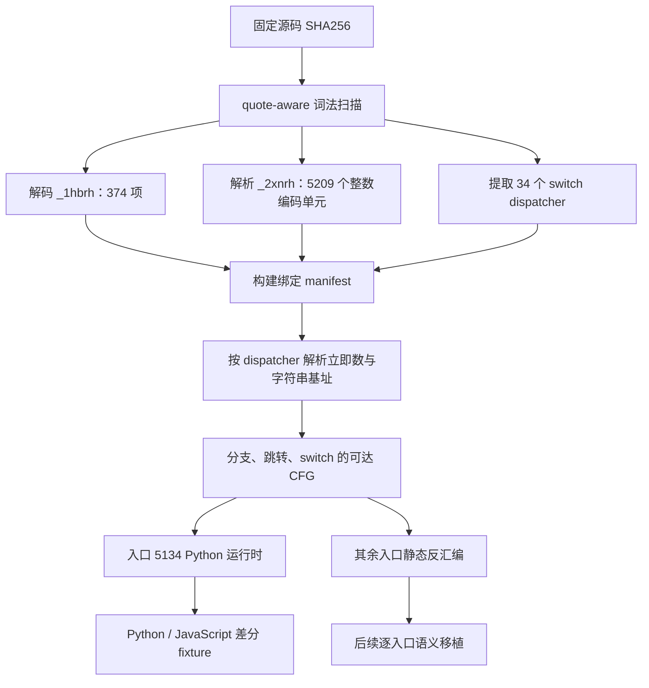
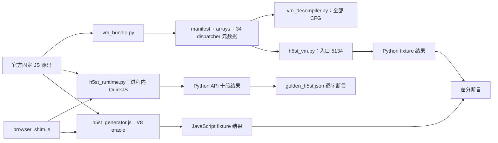

# 京东 h5st v5.3 VM 反编译、解码与解密边界

> 样本族：`js_security_v3_0.1.4.js`  
> 固定构建：官方 CDN 的 2026-05-27 Wayback 快照及其公开可读衍生样本  
> 本文核验日期：2026-07-16

本文记录从固定 JavaScript 构建中恢复字符串表、整数编码流、34 个栈式 dispatcher、控制流图，以及把最终编排入口 `_$fP.prototype._$sdnmd` 移植到 Python 的过程。文中的“解码”分为三层：字符串去混淆、VM 控制流反编译、h5st 载荷分析。三层的完成范围分别列出，避免把静态识别等同于载荷明文恢复。

## 1. 证据等级与当前结论

| 等级 | 定义 | 本文示例 |
|---|---|---|
| **E3 · 自动复现** | 当前仓库有固定输入、断言和通过的自动测试 | 374 项字符串表、5209 个编码单元、34 个 dispatcher、入口 5134 的 Python/JavaScript 差分 |
| **E2 · 字节或行为吻合** | 来源哈希、数组逐项比对或固定环境中的人工差分已核验 | Wayback 官方快照与公开可读样本的数组一致；十段 fixture 的单字符差分 |
| **E1 · 静态推断** | 由函数名、原语或数据流推断，尚缺独立明文/密文金标 | 各 h5st 段的密码学职责、环境载荷内部格式 |
| **E0 · 当前边界** | 当前仓库尚未覆盖的执行范围 | 其余 33 个 dispatcher 的纯 Python 执行、Part 8 明文恢复 |

### 1.1 状态摘要

- **E3：完整提取** `_1hbrh` 的 374 项和 `_2xnrh` 的 5209 个整数编码单元。
- **E3：完整静态建模** 34 个直接 dispatcher 的 case、立即数宽度、字符串基址与可达 CFG。
- **E3：完整离线签名运行** `utils/h5st_runtime.py` 通过 Python `quickjs==1.19.4` 扩展在进程内执行固定官方 VM；无需 Node 子进程，全流程使用确定性 shim 且零网络。
- **E3：可执行移植** 最终入口 5134，覆盖 33 个 case、62 条可达指令和 75 个尾部编码单元。
- **E3：差分测试** Python 入口 5134 与固定 JavaScript dispatcher 返回值、调用顺序完全一致。
- **E0：全部 dispatcher 原生 Python 化** 入口 5134 调用的 `_$cps`、`_$rds`、`_$clt`、`_$ms` 仍作为宿主方法注入；其余 33 个 dispatcher 由嵌入式官方 QuickJS VM 执行。
- **E0：载荷明文恢复** 当前实现生成并比较十段 h5st，但没有把第 8 段还原为独立可验证的明文对象。

因此，方案 A 当前准确表述是：**静态提取与全部 CFG 已完成，Python API 已通过进程内 QuickJS 完成端到端离线签名，最终编排 dispatcher 已另行完成原生 Python 移植；尚未把其余 33 个 dispatcher 全部改写成原生 Python handler。**

## 2. 构建溯源与哈希

### 2.1 官方 CDN 历史快照

**E2 · 字节吻合**

- 来源：[Wayback 中的京东官方 CDN 快照](https://web.archive.org/web/20260527205706id_/https://storage.360buyimg.com/webcontainer/js_security_v3_0.1.4.js)
- 本地执行文件：`archives/js_security_v3_0.1.4_20260527205706.js`
- 快照时间：`2026-05-27 20:57:06 UTC`
- 原 URL：`https://storage.360buyimg.com/webcontainer/js_security_v3_0.1.4.js`
- 解压后 JavaScript：`236,108` 字节
- 解压后 SHA256：`78ff71158c7dc6284a0ab381370be33bc8fb8fd7f25571745330848eb766c331`
- 传输 gzip 体：`78,607` 字节
- 传输 gzip 体 SHA256：`7450b1388acc2953ebdb830144a6f843bc3d713843c2f1ba4d2497776c7e9ccd`
- CDX digest：`LCVQYYGYO2YFAAOB7MFCJNHD6NMJFMXJ`
- 历史索引：[Wayback CDX 列表](https://web.archive.org/cdx/search/cdx?url=storage.360buyimg.com%2Fwebcontainer%2Fjs_security_v3_0.1.4.js&output=json&fl=timestamp,original,statuscode,mimetype,digest,length&filter=statuscode%3A200&collapse=digest)

解压后的官方快照包含 `_2xnrh` 5209 项；其值与本仓库 `h5st_bytecode.json` 逐项一致。官方历史快照是字节级金标。

### 2.2 公开可读研究样本

**E2 · 数组吻合；E1 · 源码来源属性**

- 仓库：[kb-ywl/h5st-](https://github.com/kb-ywl/h5st-)
- 固定提交：[cc4cf495fe1047f31ac621d5bb9345853b403f98](https://github.com/kb-ywl/h5st-/commit/cc4cf495fe1047f31ac621d5bb9345853b403f98)
- 固定文件：[jd_h5st/jd_mod.js](https://github.com/kb-ywl/h5st-/blob/cc4cf495fe1047f31ac621d5bb9345853b403f98/jd_h5st/jd_mod.js)
- Raw：[固定提交原始文件](https://raw.githubusercontent.com/kb-ywl/h5st-/cc4cf495fe1047f31ac621d5bb9345853b403f98/jd_h5st/jd_mod.js)
- 本地文件：`archives/js_security_v3_0.1.4_cc4cf49.js`
- 文件 SHA256：`bbe0f7569bc1823dcc90d7f41d9e28e7f5cc839704afb6ea1576a297ce1a3c78`
- 换行规范化后 SHA256：`cbe12977aadb5618ddca2616f4f89295bbc8c20fb4f7684d38a1d5aff81b1eca`

该文件是公开 beautified derivative，并非官方原始发布物。固定提交中未附 README 或许可证说明，本文只把它作为可读 VM 映射和行为差分 oracle。它的 `_1hbrh`、`_2xnrh` 与官方历史快照匹配，handler 结构适合静态提取。

### 2.3 同版本路径的构建漂移

**E2 · 采样记录**

2026-07-16 从同一 CDN 版本路径取得的当前文件已经变成另一构建：

| 项目 | 2026-05-27 固定构建 | 2026-07-16 CDN 构建 |
|---|---:|---:|
| 文件 SHA256 | `78ff7115…c331` | `3a067e38…a23f` |
| 字符串变量 | `_1hbrh` | `_1tz8d` |
| 字符串数 | 374 | 345 |
| 整数流变量 | `_2xnrh` | `_2o38d` |
| 编码单元数 | 5209 | 5133 |
| 最终入口 | 5134 | 4998 |
| 直接 dispatcher | 34 | 约 39 |

当前 CDN 文件的 `Last-Modified` 为 `2026-07-13 15:46:00 GMT`，ETag 为 `53f0d017e28339aebb3e723d46a4e125`。这说明路径中的 `0.1.4` 不是唯一构建标识；数组、dispatcher 和解释器必须以源码 SHA256 绑定为一个整体。

### 2.4 本仓库 manifest

`archives/h5st_vm_manifest.json` 固定以下关键量：

| 资产 | 数量 | canonical JSON SHA256 |
|---|---:|---|
| `_1hbrh` 字符串表 | 374 | `6cc5c66c97b2b6e48be64f46abfd0528a2c5dfbf735fb72fb56e1e3676f8da1c` |
| `_2xnrh` 整数编码流 | 5209 | `38e5fef28ac880e1d3b6203f354c5ff26d625b8f90737eb25895201fa83633d0` |
| dispatcher 元数据 | 34 | 入口列表见第 5 节 |

这里的 canonical JSON 指紧凑 JSON、UTF-8、无结尾换行。它与格式化后的文件字节哈希是两个概念。

## 3. 资产与处理流水线



当前相关文件：

```text
jd_h5st_research_report/
├── archives/
│   ├── js_security_v3_0.1.4_20260527205706.js # 官方历史快照/运行金标
│   ├── js_security_v3_0.1.4_cc4cf49.js  # 固定可读样本
│   ├── h5st_string_table.json           # 374 项完整字符串表
│   ├── h5st_bytecode.json               # 5209 个整数编码单元
│   ├── h5st_vm_dispatchers.json         # 34 个 dispatcher 的 case 元数据
│   └── h5st_vm_manifest.json            # 构建、数量和哈希绑定
├── utils/
│   ├── vm_bundle.py                     # 完整提取器
│   ├── vm_decompiler.py                 # CFG 驱动反汇编器
│   ├── h5st_runtime.py                  # Python + QuickJS 完整离线运行时
│   ├── h5st_vm.py                       # 入口 5134 Python 运行时
│   ├── browser_shim.js                  # 固定时钟、随机数和浏览器宿主
│   └── h5st_generator.js                # 固定 JavaScript 构建执行 oracle
└── tests/
    ├── fixtures/golden_h5st.json        # QuickJS 十段逐字金标
    ├── fixtures/final_vm.json
    ├── js/final_vm_reference.js
    ├── test_runtime.py
    └── test_vm.py
```

## 4. 字符串表解码

### 4.1 旧提取结果为何只有 21 项

旧脚本使用：

```python
re.search(r'var _1hbrh=\[([^\]]+)\]', source)
```

编码字符串 `_4uxrh("LC#Ty]")` 自身含 `]`，正则在该字符处提前结束；随后又把函数名中的 `4` 当成数字项。因此旧表的 0–19 项恰好正确，第 20 项被写成 `4`，而真实值是 `ghTRv`。

新提取器 `utils/vm_bundle.py` 从数组左方括号开始做平衡扫描，并跳过单引号、双引号、模板字符串、转义符及两类注释。字符串内的 `]` 不再参与括号计数。

### 4.2 `_4uxrh` 规则

**E3 · 提取测试覆盖**

对每个输入字符读取 `charCode`：

```text
charCode > 63  -> chr(charCode XOR 43)
charCode == 35 -> '#' 作为转义标记，原样复制下一个字符
其余           -> 原样复制当前字符
```

旧脚本先把字符转成整数后又写 `c == '#'`，该分支不会命中；新实现使用 `code == 35`，并检查结尾处的残缺转义。

### 4.3 完整性检查

- 解析项目只接受 `_4uxrh("…")`、普通 JSON 字符串和十进制整数。
- 未识别 token 直接触发 `BundleError`，避免静默跳过。
- 输出必须是 374 项且 canonical SHA256 等于 manifest。
- 最终入口使用 `_1hbrh[365 + operand]`；索引 365–373 为：

```text
now, _$cps, _$rds, _$clt, _$ms, _debug, concat, ms, xaWIQ
```

## 5. 5209 个编码单元与 34 个 dispatcher

### 5.1 编码单元不是指令数

`_2xnrh` 同时存放 opcode、立即数、跳转差值和 switch 表。5209 是数组整数项数量。34 个 dispatcher 共提取 1124 个 case handler；CFG 反汇编得到 3841 个互不重叠的可达指令起点。将操作数一并计入后覆盖 5184 个数组位置，另有 25 个位置位于已恢复控制流之外。

同一个数字 opcode 在不同 dispatcher 中可以表示完全不同的动作。解释器以“源码哈希 + dispatcher 入口 + opcode”定位语义，不使用跨构建或跨 dispatcher 的单一全局 opcode 表。

### 5.2 完整入口表

**E3 · `vm_decompiler.py --validate-all`**

| 入口 | 源函数/生成名 | case 数 | 可达指令 | 字符串基址 |
|---:|---|---:|---:|---:|
| 0 | `vm_0000` | 35 | 99 | — |
| 131 | `vm_0131` | 25 | 41 | 10 |
| 181 | `vm_0181` | 13 | 15 | 16 |
| 199 | `vm_0199` | 51 | 144 | 17 |
| 381 | `vm_0381` | 19 | 39 | 27 |
| 433 | `vm_0433` | 18 | 30 | 30 |
| 473 | `vm_0473` | 53 | 200 | 33 |
| 741 | `vm_0741` | 49 | 127 | 46 |
| 902 | `vm_0902` | 36 | 120 | 61 |
| 1068 | `_$YX` | 50 | 176 | 70 |
| 1304 | `vm_1304` | 46 | 114 | 82 |
| 1447 | `vm_1447` | 29 | 78 | 89 |
| 1553 | `_$YE` | 27 | 123 | 92 |
| 1720 | `vm_1720` | 54 | 142 | 113 |
| 1909 | `vm_1909` | 46 | 165 | 130 |
| 2161 | `vm_2161` | 11 | 21 | 151 |
| 2189 | `vm_2189` | 8 | 9 | 152 |
| 2199 | `vm_2199` | 8 | 9 | 153 |
| 2209 | `vm_2209` | 43 | 158 | 154 |
| 2422 | `vm_2422` | 6 | 5 | — |
| 2428 | `_$Yx` | 32 | 109 | 167 |
| 2574 | `vm_2574` | 18 | 52 | 170 |
| 2647 | `_$fQ` | 102 | 969 | 172 |
| 4004 | `_$fP.prototype._$gdk` | 53 | 141 | 246 |
| 4180 | `vm_4180` | 41 | 100 | 259 |
| 4312 | `_$fP.prototype._$pam` | 25 | 42 | 269 |
| 4367 | `_$fP.prototype._$gsp` | 19 | 69 | 274 |
| 4476 | `_$fP.prototype._$gs` | 31 | 59 | 284 |
| 4548 | `vm_4548` | 6 | 8 | 294 |
| 4560 | `_$fP.prototype._$gsd` | 31 | 119 | 297 |
| 4719 | `_$fP.prototype._$ms` | 72 | 225 | 310 |
| 5037 | `vm_5037` | 4 | 3 | 353 |
| 5042 | `_$fP.prototype._$clt` | 30 | 68 | 354 |
| 5134 | `_$fP.prototype._$sdnmd` | 33 | 62 | 365 |

### 5.3 dispatcher 提取方法

`vm_bundle.py` 对每个函数作用域执行以下步骤：

1. 定位形如 `switch(alias[pc++])` 的顶层 switch。
2. 验证 `alias` 在同一函数内绑定到 `_2xnrh`。
3. 恢复常量入口 PC、栈变量和 `Function.prototype.call` 别名。
4. 只采集 switch 顶层的 `case`，跳过 handler 内嵌函数的 switch。
5. 从每个 case 源码识别立即数读取次数、操作数宽度、字符串表基址和控制流类型。
6. 把 handler 原文连同结构化元数据写入 `h5st_vm_dispatchers.json`。

这种方法保留每个构建的真实 case 语义，也让 Python 运行时在载入时核对入口 5134 的 case 集合。

## 6. CFG 重建

**E3 · 34 个入口全部通过结构校验**

反汇编器从每个入口做工作列表遍历，仅跟随可达后继：

| flow | 后继计算 |
|---|---|
| `next` | 当前操作数区之后 |
| `jump` | `operand_pc + delta` |
| `jump_back` | `operand_pc - delta` |
| `branch` | fallthrough 与 `operand_pc + delta` |
| `branch_back` | fallthrough 与 `operand_pc - delta` |
| `switch` | default 目标及全部 case 目标 |
| `return` | 无后继 |

switch 编码为 `default_delta, case_count, value_0, delta_0, ...`。若 value 来自字符串表，反编译器按当前 dispatcher 的 `string_base` 解析。该 CFG 策略避免把内嵌函数数据、跳转表或立即数误当成 opcode。

反汇编输出示例：

```powershell
python jd_h5st_research_report/utils/vm_decompiler.py 5134 --handlers
```

每行包含数组位置、opcode、立即数、已解析字符串、流类型、后继位置；`--handlers` 额外打印对应 JavaScript case 原文。

## 7. 运行架构与 Python 移植边界



### 7.1 已实现的 JavaScript 语义

`utils/h5st_vm.py` 为入口 5134 提供：

- `undefined`、`null` 与布尔转换；
- `Function.prototype.call` 风格的 `this` 绑定；
- 对象、字符串和数组的属性读取；
- JavaScript 宽松空值相等；
- `Object.assign` 合并；
- `Date.now()` 宿主注入；
- 调试日志与可选逐步 trace；
- 栈下溢、未知 opcode 和最大步数检查。

入口 5134 的 case 集合固定为：

```text
5, 7, 9, 12, 17, 19, 21, 25, 31, 33, 34, 37, 38, 39,
41, 42, 45, 47, 48, 50, 52, 54, 55, 59, 63, 72, 74, 81,
82, 88, 91, 92, 96
```

### 7.2 最终入口的编排职责

固定 fixture 表明入口 5134 依次调用：

```text
_$cps(params)
_$rds()
_$clt(Date.now())
_$ms(cps_result, clt_result)
Object.assign(params, ms_result)
```

这一层主要负责校验、依赖准备、时间封装、主体签名调用和结果合并。四个 worker 对应前面的 dispatcher 与浏览器/CryptoJS 宿主；Python 测试以明确的宿主函数注入它们，所以测试证明的是**原始编排语义一致**，而不是 34 个入口全部完成 Python 执行。

### 7.3 完整运行时与 JavaScript oracle

完整运行的主入口是 `utils/h5st_runtime.py`。它先调用 `verify_assets()` 校验官方源码、可读源码、字符串表、整数流和 manifest 的 SHA256，再在 Python 进程内创建隔离 QuickJS context，依次载入 `browser_shim.js`、官方历史快照和 JSON bridge，最后调用 `ParamsSign.signSync()`。这一执行路径不启动 Node 子进程。

`utils/h5st_generator.js` 使用 `vm.runInThisContext` 加载同一份官方历史快照，仅作为 V8 差分 oracle。`browser_shim.js` 为两种引擎共同提供：

- 固定毫秒时间与显式 UTC+8 日期视图；
- 有种子的 `Math.random`；
- navigator、screen、document、storage、Base64 和 crypto 宿主；
- 不执行定时器回调，XMLHttpRequest 为内存 stub；
- 可注入 fingerprint，使本地 fixture 走同步路径。

Python/QuickJS 的逐字结果由 `tests/fixtures/golden_h5st.json` 固定；Node/V8 oracle 用于记录引擎间第 8 段的单字符差异。两条路径均用于离线差分与十段结构验证。

## 8. 十段 fixture 与差分边界

### 8.1 当前项目 QuickJS golden fixture

**E3 · `tests/fixtures/golden_h5st.json` 自动逐字回归**

Python 主运行时使用固定官方快照、`quickjs==1.19.4` 和仓库 `browser_shim.js`。固定输入为：

```text
Date.now() = 1784168130123
PRNG seed  = 305419896（0x12345678）
UTC+8      = 480 minutes
appId      = 586ae
functionId = unionSearchGoods
appid      = unionpc
body       = 4320c719309c0b8916765224c312f9e6e78e34f86dc87ef56aa75ca902a6665e
```

- h5st 总长度：`975`
- h5st SHA256：`4248769c0b6766b83447efbd5175960c62e57de2966ffc9d8c1efe6eb64991f8`
- 十段长度：`17, 16, 5, 92, 64, 3, 13, 660, 64, 32`

| 段 | QuickJS golden 值或摘要 | 长度 |
|---:|---|---:|
| 1 | `20260716101535123` | 17 |
| 2 | `yzzaj1ibb2pp2pp8` | 16 |
| 3 | `586ae` | 5 |
| 4 | `tk06w4530175341lf0L4bECgPYr4pjrd7qEf7qEfJiVR6DVTxCUNrrbrMJV_F-HTRiYbUK4f5LIXYWkdGGIfyTVfHaYe` | 92 |
| 5 | `04afdd55323fef01294630ece1e61a7983b63c65b99151f9f9a4ac036bff5b7b` | 64 |
| 6 | `5.3` | 3 |
| 7 | `1784168130123` | 13 |
| 8 | SHA256 `ead8d3145903049dbd0dba93e5278ec133d75b908418fc8d2ebd7a97227ab12e` | 660 |
| 9 | `eb83cbb6b359b4b0d821a17158a7254a4530c2547ced7e2140ded6d53bc8b6ab` | 64 |
| 10 | `of7rHGHQ8GlOIyVOF6ZNHuFT-bVR7qUT` | 32 |

<details>
<summary>展开当前项目完整 QuickJS h5st 金标</summary>

```text
20260716101535123;yzzaj1ibb2pp2pp8;586ae;tk06w4530175341lf0L4bECgPYr4pjrd7qEf7qEfJiVR6DVTxCUNrrbrMJV_F-HTRiYbUK4f5LIXYWkdGGIfyTVfHaYe;04afdd55323fef01294630ece1e61a7983b63c65b99151f9f9a4ac036bff5b7b;5.3;1784168130123;of7ruCLjzrkP5rkP5jFTCmIRKCENyipjxjpPFipjLDrg4jYf7fYfzTYf3L4e6rJdJbEjLrJp-jJW3WHWzCVaqiGWJrJdJbYf2iFjLrJp-LojxjJQIeFjLrJp-jJjLDIj7SnQEiVS0ipjLDrgJrIjLDIj3XETJrpjh7Jj3z5f9XIOMWlQCS1U2LFjLDIj1ipjLDrgJT4fyr2fdKIayOIjLDIj_ulS9mFPJrpjh7Jj5fIQCOGjLDIjFqEjLrJp-3kjLD7fLDIj6nYOJipjLrpjh7pe6rJdJrYf2iFjLrpjLDrgz3pjxjJf6XETJrpjLrJp-j5QfOUbzf4edGYbzjpjxjZQ8aFQKiEjLrpjLDrg6rJdJLYOJipjLrpjh7ZfLDIj0XETJrpjLrJp-nYgLDIj1XETJrpjLrJp-rojxjZe2iFjLrpjLDrg7rJdJbYOJipjLrpjh7Zf_rJdJfYOJipjLrpjh7Jj3zZf9rIjLDIj6XETJrpjLrJp-bIeLDIjAOEjLrpjLDrg63pjxj5P-ipjLrpjh7pfLDIj-ipjLrpjh7pfLDIjHOEjLrpjLD7NLDIjHyVS3KUSJrpjh7ZMwqJdJrkPJrpjh7Jj3ToNL-oe1zVRUq5d7zpf6rpWdq5P0ulS9G1WJrJdJnVO4ipjLD7N;eb83cbb6b359b4b0d821a17158a7254a4530c2547ced7e2140ded6d53bc8b6ab;of7rHGHQ8GlOIyVOF6ZNHuFT-bVR7qUT
```

</details>

这份 fixture 是当前 Python API 的逐字金标。它同时断言完整返回对象、h5st SHA256、十段长度以及固定时钟/PRNG 的重复运行一致性。

### 8.2 当前项目 QuickJS 与 Node/V8 边界

`tests/test_runtime.py` 让 `h5st_runtime.py` 与 `h5st_generator.js` 加载同一官方源码和同一 browser shim。固定输入下，段 1–7、9–10 完全一致；第 8 段等长且仅一个字符不同。该差异由自动测试显式断言，因此 QuickJS golden 作为 Python API 金标，Node 只承担 V8 差分 oracle。

### 8.3 外部 `jd_env.js` research oracle

以下 935 字符 fixture 来自外部 `jd_env.js`、CryptoJS、xorshift32 与同一官方快照的研究环境。它用于验证官方 minified 源和 GitHub readable derivative 的近等价边界，不替代当前项目的 975 字符 QuickJS golden。

#### 8.3.1 固定输入

**E2 · 官方快照与可读样本差分执行记录**

```text
Date.now() = 1784168130123
UTC        = 2026-07-16T02:15:30.123Z
Math.random seed = 0x12345678（xorshift32）
appId      = 586ae
functionId = unionSearchGoods
appid      = unionpc
body       = 4320c719309c0b8916765224c312f9e6e78e34f86dc87ef56aa75ca902a6665e
```

随机数固定器：

```javascript
let state = 0x12345678;
Math.random = () => {
  state ^= state << 13;
  state ^= state >>> 17;
  state ^= state << 5;
  return (state >>> 0) / 4294967296;
};
```

#### 8.3.2 外部 Node 环境中的官方快照输出

- h5st 总长度：`935`
- h5st SHA256：`34c895ad6f92cfbb59cdb0b42c1c58e8cba325daa382ddaa181e61c86d8c22cc`
- 十段长度：`17, 16, 5, 92, 64, 3, 13, 620, 64, 32`

| 段 | 固定值或摘要 | 长度 | 证据结论 |
|---:|---|---:|---|
| 1 | `20260716101535123` | 17 | 与固定 UTC+8 时间一致 |
| 2 | `zz5ez2veb52zz5z5` | 16 | 固定环境指纹输出 |
| 3 | `586ae` | 5 | 与构造参数 `appId` 一致 |
| 4 | `tk06w39afcd0741lf0L6dkP3aHv4pjbexWINxiYeJWFO5DUS2DENrrbrMJV_F-HbziIeTK4f6OWP0SndGSVd3Toe2j1e` | 92 | `tk06w` 前缀的固定 token 输出 |
| 5 | `f8764aa6ca71079f251296e8963566d761f4203997e4109313c3c9140917934e` | 64 | 64 位十六进制值；具体输入映射列为 E1 |
| 6 | `5.3` | 3 | 版本字段 |
| 7 | `1784168130123` | 13 | 与固定毫秒时间一致 |
| 8 | SHA256 `34cde3cd538de01b123d8d528edbaa7acca8bcae9b0c996ddb5c82be7ec378b0` | 620 | 环境/扩展载荷；本文保留原串但未恢复独立明文 |
| 9 | `da8ffa19e4a0d2671c57f5363bdd0e26deaa3652087defb918791080ed22eb26` | 64 | 64 位十六进制值；并非第 8 段文本的直接 SHA256 |
| 10 | `of7rHGHQ8GlOIyVOF6ZNHuFT-bVR7qUT` | 32 | 最终尾段；具体原语映射列为 E1 |

<details>
<summary>展开完整官方 h5st 金标</summary>

```text
20260716101535123;zz5ez2veb52zz5z5;586ae;tk06w39afcd0741lf0L6dkP3aHv4pjbexWINxiYeJWFO5DUS2DENrrbrMJV_F-HbziIeTK4f6OWP0SndGSVd3Toe2j1e;f8764aa6ca71079f251296e8963566d761f4203997e4109313c3c9140917934e;5.3;1784168130123;q3EpJXIN2DEN5XITGSEfxWVexCEjLDIj7SFjLrJp-fIf6r4f6LIe6bod0nojxjpOJrpjh7JjVaUaVKERmmHXVipjxjpe6XETJrpjh7JeLDIj9e1TJrpjh7JjJrJdJrEa-OFTGOEjLrJp-jpfJrJdJbYOJipjLDrgJbIg4zZe1uWS-GFSMWoRJrJdJTEjLrJp-jJeyvFN4b2OxOGXJrJdJ31QHyVT5ipjLDrgJj4f9G1WJrJdJTlPJrpjh7ZMLrJp4rJdJnYf2iFjLrpjLDrg3nojxjpf6XETJrpjLrJp-LYgLDIj5nYOJipjLrpjh7JjkSHXcu2f4nkVc_HjLDIj_ulS9mFPJrpjLrJp-bojxjpd2iFjLrpjLDrg7rJdJPYOJipjLrpjh7Zf_rJdJTYOJipjLrpjh7peLDIj2XETJrpjLrJp-nojxjpe2iFjLrpjLDrg63pjxj5f2iFjLrpjLDrgJbIg6zpfJrJdJnYOJipjLrpjh7pfLDIjAOEjLrpjLDrg63pjxj5P-ipjLrpjh7pfLDIj-ipjLrpjh7pfLDIjHOEjLrpjLD7NLDIjHyVS3KUSJrpjh7ZMwqJdJrkPJrpjh7JjJrJdJnVO4ipjLD7N;da8ffa19e4a0d2671c57f5363bdd0e26deaa3652087defb918791080ed22eb26;of7rHGHQ8GlOIyVOF6ZNHuFT-bVR7qUT
```

</details>

#### 8.3.3 官方快照与可读样本的差分边界

相同输入、时钟与随机序列下：

| 构建 | h5st SHA256 | 差异 |
|---|---|---|
| 官方 Wayback 快照 | `34c895ad6f92cfbb59cdb0b42c1c58e8cba325daa382ddaa181e61c86d8c22cc` | 第 8 段 offset 473 为 `b` |
| GitHub 可读样本 | `7688fe9ecaef4021142712b19e949cdd3c1ca24325465bc129191021a15505bd` | 第 8 段 offset 473 为 `X` |

差异上下文：

```diff
- rpjLDrgJbIg6zpfJr   # 官方
+ rpjLDrgJXIg6zpfJr   # 可读样本
```

其余九段完全一致，第 8 段长度也同为 620。第 9 段在两次运行中都为 `da8ffa…eb26`，而第 8 段文本 SHA256 分别是 `34cde3…78b0` 与 `9a9173…dbb4`。这直接排除了“第 9 段等于第 8 段文本 SHA256”的旧描述。

结论：

- 官方 Wayback 快照用于逐字 fixture 金标；
- GitHub 可读样本用于 dispatcher、handler 和调用链研究；
- 可读样本的端到端输出采用“除已记录单字符外一致”的近等价边界；
- 源码版本字符串相同并不代表构建字节或环境序列化完全一致。

## 9. 密码学识别与“解密”边界

### 9.1 已识别原语

**E2 · 源码静态存在**

固定源码中可见并注册：

```text
MD5
SHA256
HmacSHA256
HmacMD5
```

存在这些实现只证明构建具备相应原语。把某个原语指定给 h5st 某一段，还需要沿 dispatcher 调用链恢复输入、key、编码器和输出去向。

### 9.2 已完成的解码层

| 层 | 状态 | 验证方式 |
|---|---|---|
| `_4uxrh` 字符串去混淆 | E3 | 374 项、hash、尾窗和源码重提取一致 |
| VM case/立即数解析 | E3 | 34 个 dispatcher 元数据 |
| CFG 恢复 | E3 | 34 个入口、3841 条可达指令通过校验 |
| 最终 dispatcher 执行 | E3 | Python 与原 JavaScript 差分一致 |
| Python API 十段 h5st 离线生成 | E3 | 进程内 QuickJS、官方固定源码、golden fixture 逐字断言 |
| Node/V8 与 QuickJS 引擎差分 | E3 | 段 1–7、9–10 相同；段 8 等长且单字符不同 |
| 第 8 段独立明文恢复 | E0 | 当前仓库没有明文 fixture 与逆变换实现 |
| 全部 34 个 dispatcher 原生 Python 执行 | E0 | 原生解释器执行入口 5134；其余入口已有完整 CFG，并由嵌入式 QuickJS 执行 |

### 9.3 第 8 段的分析原则

第 8 段包含大量重复字形，静态源码也包含多种密码学及编码组件；这些现象可以指导数据流追踪，但尚不足以单独确认 AES 模式、key/IV 或自定义替换层。后续恢复应至少加入：

1. 同一构建的固定明文环境对象；
2. 加密前、编码前、最终段三个观察点；
3. key、IV、padding、字符集和序列化顺序；
4. 正向输出金标与逆向明文金标；
5. 修改单字段后的逐字差分。

在这些证据齐备前，本文把第 8 段称为“环境/扩展载荷”，把 64 位段称为“十六进制值”，避免提前绑定具体算法。

## 10. 验证命令

以下命令均从仓库根目录运行。

### 10.1 安装并运行完整 Python/QuickJS 签名

```powershell
python -m venv .venv
.\.venv\Scripts\python -m pip install -r jd_h5st_research_report\requirements.txt
.\.venv\Scripts\python jd_h5st_research_report\utils\h5st_runtime.py `
  --app-id 586ae `
  --params '{"functionId":"unionSearchGoods","appid":"unionpc","body":"4320c719309c0b8916765224c312f9e6e78e34f86dc87ef56aa75ca902a6665e"}' `
  --now-ms 1784168130123 `
  --seed 305419896
```

输出应与 `tests/fixtures/golden_h5st.json` 的 `expected` 逐字相同：h5st 长度 975、SHA256 为 `4248769c0b6766b83447efbd5175960c62e57de2966ffc9d8c1efe6eb64991f8`。

### 10.2 重建构建绑定资产

```powershell
python jd_h5st_research_report/utils/vm_bundle.py
```

期望摘要：

```text
extracted 374 strings, 5209 cells and 34 dispatchers
```

提取器先校验源码 SHA256。若传入另一构建，会在写文件前报告 build mismatch。`--allow-other-build` 仅跳过源码 hash，结构数量检查仍保留；研究新构建时应输出到新的目录和 manifest，避免覆盖固定资产。

### 10.3 校验全部 CFG

```powershell
python jd_h5st_research_report/utils/vm_decompiler.py --validate-all
```

期望输出 34 个入口；其中：

```text
0000: 99 reachable instructions
2647: 969 reachable instructions
5134: 62 reachable instructions
```

全部入口的可达指令总数为 3841。

### 10.4 运行原生 Python 最终 dispatcher

```powershell
python jd_h5st_research_report/utils/h5st_vm.py
```

期望输出：

```json
{"out":{"alpha":1,"beta":"two","vm":"PYTHON","nested":{"ok":true}},"calls":[["cps",{"alpha":1,"beta":"two"}],["rds"],["clt",1700000000123],["ms",{"cps":"C"},"CLT"]]}
```

### 10.5 运行自动测试

```powershell
.\.venv\Scripts\python -m unittest discover -s jd_h5st_research_report/tests -p "test_*.py" -v
```

安装 QuickJS 依赖和 Node.js 时，期望 12 项通过：

```text
Ran 12 tests
OK
```

测试覆盖：

1. 官方与可读源码 SHA256及逐项相同的提取结果；
2. 未登记或损坏的源码快速拒绝；
3. 数组与已提交资产逐项一致；
4. 34 个 dispatcher 都有有效 CFG；
5. 原生 Python 入口 5134 的固定结果及 JavaScript 差分；
6. Python/QuickJS 完整十段 golden fixture；
7. 固定时钟和 PRNG 的逐字确定性；
8. Node/V8 与 Python/QuickJS 已知单字符边界。

### 10.6 获取并核验官方历史快照

```powershell
$url = 'https://web.archive.org/web/20260527205706id_/https://storage.360buyimg.com/webcontainer/js_security_v3_0.1.4.js'
$out = Join-Path $env:TEMP 'jd_js_security_v3_0.1.4_20260527.js'
curl.exe -L --compressed --fail $url -o $out
Get-Item $out | Select-Object Length
Get-FileHash $out -Algorithm SHA256
```

常见客户端会自动解压，期望：

```text
Length : 236108
SHA256 : 78FF71158C7DC6284A0AB381370BE33BC8FB8FD7F25571745330848EB766C331
```

### 10.7 固定 Node/V8 十段 smoke test

当前仓库的 Node oracle 可接受 stdin JSON：

```powershell
@'
{
  "app_id": "586ae",
  "params": {
    "functionId": "unionSearchGoods",
    "appid": "unionpc",
    "body": "4320c719309c0b8916765224c312f9e6e78e34f86dc87ef56aa75ca902a6665e"
  },
  "now_ms": 1784168130123,
  "seed": 305419896
}
'@ | node jd_h5st_research_report/utils/h5st_generator.js --stdin
```

断言重点是退出码为 0、结果含 `_stk`，且 `h5st.split(';').length === 10`。该 smoke test 使用仓库 browser shim；第 8 节的逐字金标使用官方快照、固定 `jd_env` 和 xorshift32，二者属于不同 fixture。

## 11. 失败信号与排查顺序

| 信号 | 优先检查 |
|---|---|
| source build mismatch | 源文件 SHA256、提交号、换行是否与 manifest 一致 |
| 字符串数不是 374 | quote-aware 括号扫描、`#` 转义、变量名是否发生漂移 |
| 字节码数不是 5209 | 当前 CDN 构建是否替换了 `_2xnrh` |
| dispatcher 数不是 34 | switch 识别、函数作用域、数组 alias 和固定入口 |
| CFG 出现未知 opcode | dispatcher metadata 与 bytecode 是否来自同一源码 |
| 字符串索引越界 | 当前 dispatcher 的 `string_base` 是否正确 |
| Python/JS 调用顺序不同 | `this` 绑定、null/undefined、call 参数个数、Date.now 注入 |
| 十段 fixture 只在第 8 段变化 | 先比对 shim、随机序列与环境序列化；保留官方/可读版单字符边界 |

## 12. 后续移植顺序

基于最终入口的真实调用关系，建议按以下顺序扩展纯 Python 运行时：

1. `_$cps`：参数校验与规范化；
2. `_$rds`：fingerprint、token、algo 缓存及本地/远程分支；
3. `_$clt`：时间与环境字段采集；
4. `_$ms`：主体签名和十段拼装；
5. `_$gdk`、`_$pam`、`_$gsp`、`_$gs`、`_$gsd`：key、算法选择与数据变换；
6. CryptoJS 和浏览器宿主绑定；
7. 用官方历史 fixture 对十段逐字回归；
8. 为漂移构建生成独立 manifest，而非复用旧 opcode 映射。

每移植一个入口，都应同时提交：源码 hash、入口 PC、case 集合、CFG 数量、宿主依赖、固定输入输出和 JavaScript 差分。这样“静态已覆盖”与“Python 已执行”始终保持可审计的边界。
